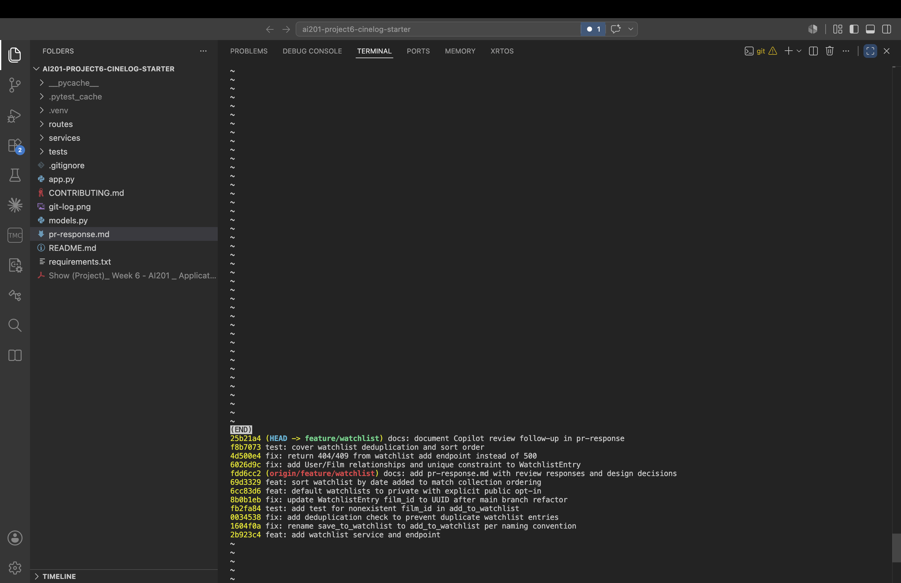

# PR Response Doc — CineLog Watchlist Feature

## AI Usage
I used AI (Claude Code) heavily on this project, and I want to be honest about how:

- **Getting the overall picture:** understanding the existing codebase — what the collection
  service, models, and tests did — before I started, so the review comments made sense.
- **Writing code:** AI wrote the actual changes as I directed each step — the rename, the
  deduplication (mirroring `add_to_collection`), the visibility parameter, and the tests.
- **The rebase:** working through the UUID merge conflict onto `main` and cleaning up the
  commit history into conventional commits.
- **Drafting this document,** including first drafts of the design arguments below.
- **The Copilot follow-up fixes:** after I opened the PR, AI helped diagnose and fix the
  `get_watchlist()` crash, the route error handling, and the extra tests.

For the two design decisions (Comments 4 and 5), the positions and the underlying reasons are
my own — private-by-default because of how I feel about my own privacy, and newest-first
because of how I actually use a watchlist (I rewatch films I love until they wear out, so I
want fresh additions on top). AI helped me phrase and stress-test those arguments, but the
calls and the reasons behind them are mine.

---

## Comment 1 — Rename
**What I did:** Renamed `save_to_watchlist()` to `add_to_watchlist()` in
`services/watchlist_service.py` to match the project's `verb_to_noun` convention
(`add_to_collection()`), and updated the one call site plus the import in
`routes/watchlist/watchlist.py`.
**How I verified:** Ran a project-wide search (`grep -rn "save_to_watchlist" --include="*.py"`)
to confirm no references remained, then ran the full test suite — 4 tests still passed.

## Comment 2 — Deduplication
**What I did:** Added a duplicate-entry check to `add_to_watchlist()`, following the exact
pattern in `add_to_collection()`: query for an existing `WatchlistEntry` with the same
`user_id`/`film_id` and raise a new `AlreadyInWatchlistError` if one exists, before creating
the entry. I added the `AlreadyInWatchlistError` class at the top of the service module,
mirroring how `AlreadyInCollectionError` is defined in `collection_service.py`.
**How I verified:** Read `add_to_collection()` to confirm the dedup happens *after* the
film-existence check and *before* the insert, and reproduced that ordering. Confirmed the
module imports cleanly and the full suite still passed.

## Comment 3 — Missing test
**What I did:** Created `tests/test_watchlist.py` with
`test_add_to_watchlist_nonexistent_film_raises`, the direct equivalent of
`test_add_to_collection_nonexistent_film_raises`. It reuses the same fixture structure
(`app` with an in-memory SQLite DB, `sample_user`) and the same assertion style
(`pytest.raises(FilmNotFoundError)` for a nonexistent film id).
**How I verified:** `pytest tests/test_watchlist.py -v` passes; the full suite is now 5 passing.

## Comment 4 — Default visibility
**My position:** `WatchlistEntry.public` should default to **`False` (private)**, not `True`.

**Reasoning:** For me this really comes down to privacy. When I save a film I'm planning to
watch, that feels personal — it says something about what I'm into right now — and I wouldn't
want it shown to other people unless I actually chose to share it. A watchlist feels more
personal to me than a list of things I've already watched, because it's about what I intend to
do, not just my history. So defaulting it to public felt wrong: it exposes something private
without the user ever deciding to. The default should protect the user first, and sharing
should be a choice they make on purpose.

**Tradeoff acknowledged:** CineLog is a community app, so public-by-default would give it more
shared watchlists to browse and would help people discover films through each other. Going
private-by-default means fewer public lists and slower community discovery — that's a real
cost. I still think privacy wins here: I'd rather the app share too little by default than too
much. And sharing isn't lost — it's still fully possible through the `public` opt-in I added,
it just becomes something the user turns on intentionally.

**Implementation:** I shipped this rather than leaving it as an argument. Flipping the default
to `False` on its own would make every watchlist permanently private (nothing could ever be
shared), so I paired it with an explicit `public` opt-in parameter on `add_to_watchlist()` and
the `/watchlist/<user_id>/add` endpoint (the visibility-toggle stretch feature). Private is now
the safe default *and* sharing stays possible via `{"public": true}`. See the Stretch Features
section below.

## Comment 5 — Sort order
**My position:** Change `get_watchlist()` to sort by **`date_added` descending (newest first)**,
matching `get_collection()`. (Implemented.)

**Reasoning:** The main reason for me is how I actually use a watchlist: I want the newest
things I've added showing up first. When I really like a film I tend to rewatch it a lot — to
the point where it starts to lose its effect and I get a little tired of it. So the films I
just added are the ones I'm genuinely excited to watch right now, and those are what I want at
the top. Alphabetical order buries a film I added yesterday somewhere in the middle just
because of its title, which isn't how I'd actually reach for the list.

**Engagement with reviewer's point:** I also agree with the maintainer's consistency argument —
`get_collection()` already returns newest-first (`date_added.desc()`), and it would feel
incoherent for the two lists to sort differently. But I'm not only agreeing for consistency's
sake; newest-first genuinely fits how a watchlist gets used. I matched `date_added.desc()`
exactly (descending, not ascending) so the watchlist and collection views line up. If someone
really needs alphabetical for looking a title up, I think that belongs in an optional sort
later, not as the default.

## Comment 6 — Rebase
**What conflicted:** My `feature/watchlist` branch was based on the pre-refactor commit, where
film IDs were integers. `main` had since migrated film IDs from `Integer` to UUID
`String(36)`. Rebasing onto `main` produced two issues:
1. **`models.py`** — Git's 3-way auto-merge resolved the file to `main`'s version and, in doing
   so, *silently dropped* my `WatchlistEntry` class (it was an addition that lost out to main's
   copy of the surrounding file — no conflict markers, but the model was gone).
2. **`.gitignore`** — an add/add conflict, because both my branch and `main` had added one.

**How I resolved it:**
- `.gitignore`: `git rebase --skip` on my now-redundant `.gitignore` commit, since `main`
  already provides an equivalent one. (The course PDF is kept out of git locally via
  `.git/info/exclude`.)
- `models.py`: re-added the `WatchlistEntry` model with `film_id` as `String(36)` UUID
  (matching `CollectionEntry`) instead of the pre-refactor `Integer`, and updated the stale
  `film_id (int)` docstrings in `watchlist_service.py` and the route. Committed as
  `fix: update WatchlistEntry film_id to UUID after main branch refactor`.

**How I verified no conflict remains:** `git status` is clean; `git log --oneline` shows a
linear history rebased on top of `main` with **no merge commit**; the app boots and registers
all three blueprints; `pytest tests/ -v` passes all 5 tests; and a `grep` confirmed no
remaining integer `film_id` references in the watchlist code.

---

## Stretch Features

**Visibility toggle (`public` parameter):** Added an optional `public` parameter to
`add_to_watchlist(user_id, film_id, public=False)` and the `POST /watchlist/<user_id>/add`
endpoint (`{"film_id": "<uuid>", "public": true}`). This lets callers set visibility
explicitly instead of relying on the default, and is what makes the private-by-default
decision (Comment 4) workable — private is the safe default, sharing is an explicit opt-in.

**Second test (edge case of my choice):** Beyond the required nonexistent-film test, I added
two tests in `tests/test_watchlist.py`:
- `test_add_to_watchlist_defaults_to_private` — verifies a new entry is `public is False` when
  the caller doesn't specify, locking in the Comment 4 default. I chose this case because the
  default is a *silent* behavior no other test would catch — a future change flipping it back
  to public would otherwise pass CI unnoticed.
- `test_add_to_watchlist_respects_public_flag` — verifies `public=True` actually produces a
  public entry, so the opt-in toggle can't silently no-op.

---

## Follow-up: Automated Review (Copilot)

After opening the PR, GitHub Copilot's review flagged three issues beyond the six human
comments. All three were valid and are addressed:

1. **`WatchlistEntry` had no `film`/`user` relationship** — `get_watchlist()` calls
   `entry.film`, so `GET /watchlist/<user_id>` crashed with `AttributeError` (my tests missed
   it because none exercised `get_watchlist()`). Added `watchlist_entries` relationships on
   `User` and `Film` (mirroring `CollectionEntry`), plus a `UniqueConstraint(user_id, film_id)`
   for DB-level dedup safety under concurrency. Verified `GET /watchlist` now returns 200.
2. **Route returned 500 for invalid requests** — the endpoint didn't catch `FilmNotFoundError`
   or `AlreadyInWatchlistError`. Added the same `try/except` the collection route uses, so a
   nonexistent film returns 404 and a duplicate returns 409.
3. **Missing test coverage** — added `test_add_to_watchlist_duplicate_raises` and
   `test_get_watchlist_returns_newest_first` (mirroring `test_collection.py`). The sort test
   also guards against a regression of issue #1. Suite is now 9 passing tests.

---

## Git Log Screenshot

`git log --oneline` on `feature/watchlist` after the interactive rebase — 8 conventional
commits, one logical change each, rebased on `main` with no merge commits:



---

## PR Description

**What the feature does:** Adds a **watchlist** — a list of films a user intends to watch,
separate from their `collection` (films already watched).

- **Model** `WatchlistEntry` (`models.py`): UUID primary key, `user_id`, `film_id` (UUID),
  `date_added`, and a `public` visibility flag.
- **Service** (`services/watchlist_service.py`):
  - `add_to_watchlist(user_id, film_id)` — validates the film exists (`FilmNotFoundError`),
    prevents duplicates (`AlreadyInWatchlistError`), then creates the entry.
  - `get_watchlist(user_id)` — returns the user's watchlist sorted by date added, newest first.
- **Endpoints** (`routes/watchlist/watchlist.py`, registered at `/watchlist`):
  - `GET  /watchlist/<user_id>` — list the watchlist.
  - `POST /watchlist/<user_id>/add` — body `{ "film_id": "<uuid>" }`.

**Design decisions made:**
1. **Default visibility → private (`public=False`)** — sharing should be an explicit opt-in
   (see Comment 4).
2. **Sort order → date-added, newest first** — consistent with `get_collection()` and better
   matched to how a watchlist is used (see Comment 5).

**How to manually test the feature:**
```bash
# 1. Start the app
python app.py            # serves at http://127.0.0.1:5000

# 2. Seed a user and a film, and grab their UUIDs (in a second terminal)
python - <<'PY'
from app import create_app, db
from models import User, Film
app = create_app()
with app.app_context():
    u = User(username="ashok", email="ashok@example.com")
    f = Film(title="Dune: Part Two", year=2024, genre="Sci-Fi")
    db.session.add_all([u, f]); db.session.commit()
    print("USER_ID =", u.id)
    print("FILM_ID =", f.id)
PY

# 3. Add the film to the watchlist (use the printed IDs)
curl -X POST http://127.0.0.1:5000/watchlist/<USER_ID>/add \
     -H "Content-Type: application/json" \
     -d '{"film_id": "<FILM_ID>"}'
# → 201 with the new entry (note "public": false)

# 4. Adding the same film again is rejected (deduplication)
curl -X POST http://127.0.0.1:5000/watchlist/<USER_ID>/add \
     -H "Content-Type: application/json" \
     -d '{"film_id": "<FILM_ID>"}'

# 5. View the watchlist (newest first)
curl http://127.0.0.1:5000/watchlist/<USER_ID>
```
